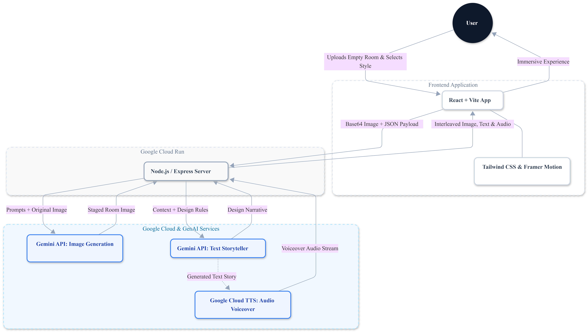

# Virtual Staging Storyteller

An AI-powered virtual staging tool that transforms empty rooms into beautifully designed spaces. Upload a photo, choose a style, and experience an immersive presentation with AI-generated staging, a design narrative, and voiceover audio.



## Architecture

```
User → React + Vite Frontend → Node.js / Express (Cloud Run) → Google Cloud & GenAI Services
```

**Frontend** — React with Tailwind CSS and Framer Motion for a polished, responsive UI.

**Backend** — Node.js / Express server deployed on Google Cloud Run, handling image processing, API orchestration, and lead capture.

**Google Cloud & GenAI Services:**
- **Gemini API (Image Generation)** — Takes the original room photo + style prompt and generates a photorealistic staged image.
- **Gemini API (Text Storyteller)** — Produces a design narrative explaining the styling choices, with optional Feng Shui principles.
- **Google Cloud Text-to-Speech** — Converts the design story into a natural voiceover audio stream for hands-free touring.

### Data Flow

1. User uploads an empty room photo and selects a room type, style, and optional Feng Shui mode.
2. Frontend sends the Base64 image + JSON payload to the backend.
3. Backend resizes the image (via Sharp) and sends prompts + image to Gemini API for staged image generation and design narrative.
4. The generated text story is sent to Google Cloud TTS for audio voiceover.
5. Backend returns the staged image, text narrative, and audio to the frontend.
6. Frontend presents an immersive experience: the staged image fades in, the story reveals paragraph by paragraph, and the user can listen to the voiceover.

## Tech Stack

| Layer | Technology |
|-------|-----------|
| Frontend | React, Vite, Tailwind CSS, Framer Motion |
| Backend | Node.js, Express, Sharp (image resizing) |
| AI | Gemini API (image generation + text) |
| Audio | Google Cloud Text-to-Speech |
| Database | Supabase (PostgreSQL) |
| Font | Inter |

## Setup

1. **Install Dependencies**:
    ```bash
    npm install
    ```

2. **Environment Variables**:
    Create a `.env` file with:
    ```
    GEMINI_API_KEY=your_api_key_here
    SUPABASE_URL=your_project_url
    SUPABASE_SERVICE_ROLE_KEY=your_service_role_key
    ```
    The Gemini key is also used for Google Cloud TTS. Ensure the Cloud Text-to-Speech API is enabled on your GCP project.

3. **Run Development Server**:
    ```bash
    npm run dev
    ```
    Starts the Express server with Vite middleware on `http://localhost:3001`.

## API Endpoints

- `POST /api/stage-room` — Upload an image with style, room type, and Feng Shui preference. Returns a staged image and design story.
- `POST /api/tts` — Convert text to speech audio (Base64 MP3).
- `GET /api/leads` — Retrieve captured leads.

## Features

- **Room Type Selection** — Bedroom, Living Room, Kitchen, and more, with custom input support.
- **Style Presets** — Modern Farmhouse, Scandinavian Minimalist, Industrial Loft, Mid-Century Modern, Coastal Breeze, Traditional Luxury — each with preview images.
- **Feng Shui Mode** — Optional toggle to apply Feng Shui principles (Qi flow, commanding position, five elements) to the design.
- **Paragraph-by-paragraph story reveal** — Design narrative fades in progressively.
- **Audio voiceover** — Listen to the design story via Google Cloud TTS while touring the property.
- **Lead capture** — Collects visitor name, email, and phone before staging.

## Project Structure

- `server.ts` — Express backend, API routes, Gemini + TTS integration.
- `src/` — React frontend code.
- `src/components/LeadForm.tsx` — Lead capture form.
- `src/components/StagingTool.tsx` — Room type, style, and Feng Shui selection UI.
- `src/components/ResultView.tsx` — Staged image, story reveal, and audio playback.
- `public/images/` — Style preview images and architecture diagram.
